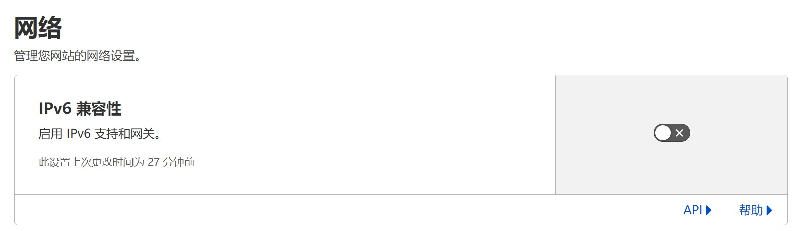
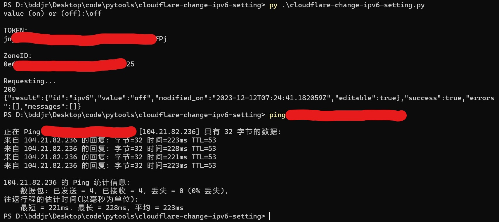
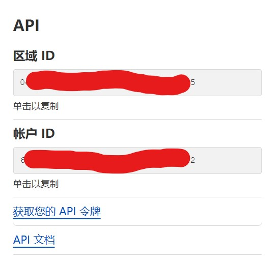
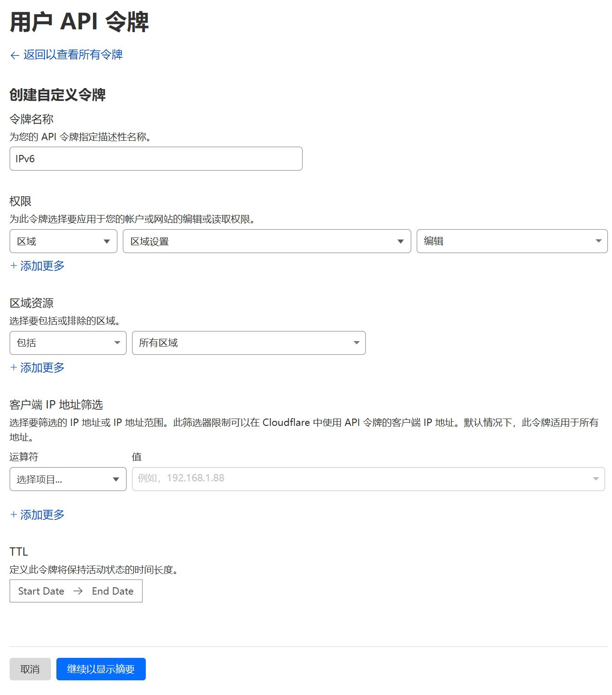

# Language
> `简体中文 (zh-CN)`  

***
# Cloudflare Change IPv6 Setting
用于关闭或开启 Cloudflare CDN 的 IPv6

> 不要指望指望关闭IPv6之后，那些开了IPv6的用户能正常解析。IPv6解析不了的问题就在连接DNS服务器用的是IPv6，而非域名解析结果用IPv6。  
> 下载py文件还是太麻烦了，想要网页版？对不起，Cloudflare API 里并没有允许跨域访问，也就是说相关操作必须直接在电脑上请求。  

***
## 效果图

[点此查看itdog测速效果图](README/itdog.md)






***
## 开始使用

### 获取ZoneID
登录 <https://dash.cloudflare.com> ，然后点击你想要修改的域名，在右下角复制 `区域ID` 。



### 获取TOKEN
<https://dash.cloudflare.com/profile/api-tokens>  
在此处创建令牌，选择下方的 `创建自定义令牌` ，然后按照下方图片的格式选择，再点击 `继续以显示摘要` ，然后复制TOKEN。

  

### 在 Windows 系统运行
#### 1. 安装 python3
点开下方链接，然后点击带有`Latest Python 3 Release`的超链接下载安装包，然后运行安装包。  
<https://www.python.org/downloads/windows/>  

#### 2. 安装 requests 模块
```cmd
pip install requests
```

#### 3. 运行
双击 `start.bat` 运行，或使用命令运行
```cmd
py cloudflare-change-ipv6-setting.py
```

### 在 Linux 系统运行 (未实测)
#### 1. 安装 python3 与 pip3
自己上网查找对应系统的安装命令

#### 2. 安装 requests 模块
```cmd
pip3 install requests
```

#### 3. 运行
```sh
python3 cloudflare-change-ipv6-setting.py
```
